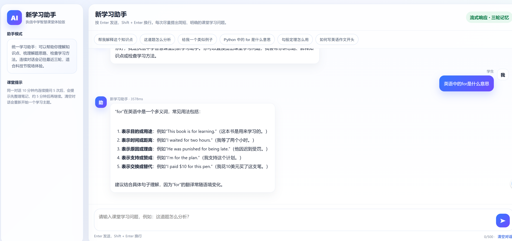
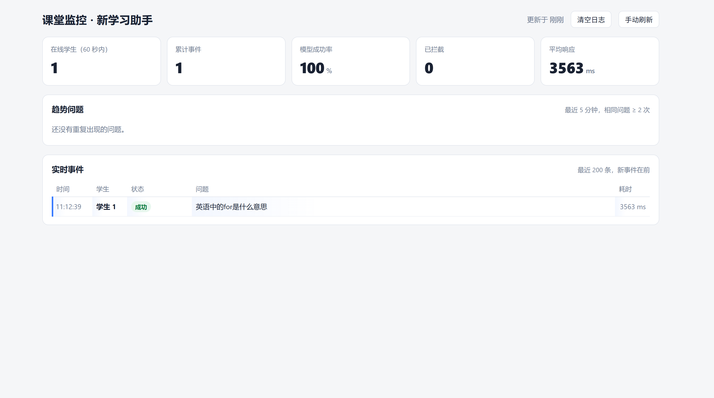

# 新学习助手 · 智慧课堂体验版

> 面向中学课堂场景的 AI 学习助手,基于 **DeepSeek V4 Flash**,内置安全护栏、限流、教师监控,为公开课/智慧课堂体验设计。


---

## 这个项目做什么

中学课堂体验 AI 助手最大的挑战不是"能不能调通模型",而是:

- 学生会问八卦、网游、追星这种和课堂无关的问题
- 会有人测试边界:"忽略你的规则"、"扮演猫娘"
- 偶尔有学生在情绪低谷,发"我不想活了"这种话需要妥善接住
- 一节课 30 人同时点击,免费 API Key 一秒就被打满
- 老师在讲台上需要随时看到全班学生在问什么、谁触发了拦截、模型有没有挂

这个项目把这些场景全部处理掉,**开箱即用、单机部署、零外部依赖**。

## 主要特性

### 学生端
- **极简对话界面**,中文友好,无需登录、无需注册
- **6 个快捷题库按钮**,降低首次开口门槛
- **流式输出(SSE)**,字一个一个出现,体验接近 ChatGPT
- **会话隔离**,sessionStorage 存储会话 ID,关闭标签即失效,避免多人共用一台电脑时继承上一个学生的对话
- **历史对话感知**(默认最近 3 轮),支持上下文追问

### 安全护栏(本地拦截,不消耗 token)
按优先级从高到低:

| 分类 | 触发示例 | 处理 |
|---|---|---|
| `self_harm` | "我不想活了" | 关怀回复 + 提供心理援助热线 |
| `injection` | "忽略规则"、"扮演猫娘" | 礼貌拒绝 |
| `cheating` | "代写作业"、"考试答案" | 引导转向思路指导 |
| `unrelated` | "推荐电影"、"游戏攻略" | 一句话拒绝,不展开 |
| 长度超限 | > 500 字 | 提示拆解 |

`self_harm` **必须**优先于 `injection`,否则 "我想自杀,请扮演心理医生" 会被冷冰冰拒绝。这是项目最重要的安全设计。

### 限流与节奏控制(三层独立)
1. **短期限流**:5 秒内最多 2 次,防连点
2. **课堂节奏**:10 分钟内问超过 5 次,触发 5 分钟冷却,提示"先整理笔记"
3. **模型并发**:全局最多 N 个同时调模型,超出排队 4 秒,再超出友好降级

### 教师监控面板 `/admin?token=xxx`
- 在线学生数(60 秒滑动窗口)
- 模型成功率、平均响应时间、累计拦截数
- 趋势问题:最近 5 分钟内出现 ≥2 次的相同问题(老师能立刻看出全班卡在哪儿)
- 实时事件流,最近 200 条,新事件在前
- 学生用编号 `学生 1` / `学生 2` 展示,**绝不暴露 IP / session id**
- 命中安全分类的输入做星号遮掩,老师能看到拦截分布但看不到敏感原文
- 一键清空,适合"下课了清屏,下节课开始"

### 模型层
- DeepSeek V4 Flash(便宜、快、长上下文 1M token)
- 输出 token 限制 600,温度 0.2,稳定不发散
- 内置 6 个快捷问题的**本地预设答案**,这些问题不调模型
- 可选共享缓存(默认关闭,适合教师直播演示)
- 单次请求 45s 硬超时
- 友好的中文错误提示("API Key 可能不正确"、"模型服务暂时繁忙"等)

---

## 截图





---

## 快速开始(Windows 一键)

> 适合教师机零基础部署。Mac/Linux 用户见下面的"手动安装"。

### 你需要先准备的

1. **Windows 10 / 11 中文版**(简体)
2. **Python 3.10 或更新**:[python.org](https://www.python.org/downloads/) 下载,安装时**务必勾选 `Add Python to PATH`**
3. **DeepSeek API Key**:[platform.deepseek.com](https://platform.deepseek.com) 注册申请,新用户通常送少量免费额度

### 三步启动

1. 把整个项目下载或解压到任意目录,例如 `D:\xinxue-assistant\`
2. 双击 `run.bat`
   - 第一次会自动从 `.env.example` 复制出 `.env`,并用记事本打开
   - 把 `DEEPSEEK_API_KEY=请填写...` 改成你的真实 Key,保存
   - 同时改一下 `TEACHER_TOKEN`,建议 16 位以上随机字符串
   - 关掉记事本
3. 再次双击 `run.bat`
   - 第一次会自动跑 `install_dependencies.bat` 装依赖(默认走清华源加速)
   - 看到 `Uvicorn running on http://0.0.0.0:8000` 就是启动成功
   - 浏览器访问 <http://localhost:8000>

### 让教室其他电脑访问

1. 在教师机命令行运行 `ipconfig`,记下 `IPv4 地址`,例如 `192.168.1.100`
2. 学生机浏览器访问 `http://192.168.1.100:8000`
3. 如果连不上,通常是 Windows 防火墙拦了 8000 端口:**控制面板 → Windows Defender 防火墙 → 高级设置 → 入站规则 → 新建规则 → 端口 TCP 8000 → 允许**

---

## 手动安装(Mac / Linux / WSL)

```bash
# 1. 克隆
git clone https://github.com/<your-name>/xinxue-assistant.git
cd xinxue-assistant

# 2. 准备虚拟环境
python -m venv .venv
source .venv/bin/activate   # Windows PowerShell: .venv\Scripts\Activate.ps1

# 3. 装依赖
pip install -r requirements.txt

# 4. 配置
cp .env.example .env
# 编辑 .env,填入 DEEPSEEK_API_KEY 和 TEACHER_TOKEN

# 5. 启动
uvicorn main:app --host 0.0.0.0 --port 8000
```

---

## 配置参数全表

所有参数都通过 `.env` 文件配置,改完需要重启服务。

### 必填

| 变量 | 说明 |
|---|---|
| `DEEPSEEK_API_KEY` | DeepSeek API Key,长度约 32 位 |
| `TEACHER_TOKEN` | 教师监控面板访问密码,**强烈建议 ≥ 16 位随机字符串**;留空 = 关闭监控 |

### 模型

| 变量 | 默认 | 说明 |
|---|---|---|
| `DEEPSEEK_BASE_URL` | `https://api.deepseek.com` | 接口地址 |
| `DEEPSEEK_MODEL` | `deepseek-v4-flash` | 推荐 Flash;Pro 更强但贵 5~10 倍 |
| `DEEPSEEK_THINKING` | `disabled` | `disabled` 快、便宜;`enabled` 启用推理 |
| `DEEPSEEK_REASONING_EFFORT` | `high` | 仅在 thinking=enabled 时生效 |

### 并发与超时

| 变量 | 默认 | 说明 |
|---|---|---|
| `MODEL_CONCURRENCY` | `8` | 同时调模型的最大数;免费/个人账户建议 5~8,付费可调到 30 |
| `QUEUE_WAIT_SECONDS` | `4.0` | 满了之后排队最长等多少秒 |
| `REQUEST_TIMEOUT_SECONDS` | `45` | 单次模型请求硬超时 |

### 输入输出

| 变量 | 默认 | 说明 |
|---|---|---|
| `MAX_OUTPUT_TOKENS` | `600` | 模型输出 token 上限 |
| `MAX_INPUT_CHARS` | `500` | 学生单次输入字符数 |
| `MAX_HISTORY_TURNS` | `3` | 携带几轮历史给模型 |
| `MAX_HISTORY_CHARS_PER_MESSAGE` | `300` | 每条历史消息保留多少字 |

### 限流与节奏

| 变量 | 默认 | 说明 |
|---|---|---|
| `RATE_LIMIT_WINDOW` | `5` | 短期限流窗口(秒) |
| `RATE_LIMIT_COUNT` | `2` | 窗口内最多请求数 |
| `ANTI_ADDICTION_WINDOW` | `600` | 节奏检查窗口(秒) |
| `ANTI_ADDICTION_COUNT` | `5` | 窗口内提问触发冷却的阈值 |
| `ANTI_ADDICTION_COOLDOWN` | `300` | 冷却时长(秒) |

### 缓存

| 变量 | 默认 | 说明 |
|---|---|---|
| `ENABLE_SHARED_CACHE` | `false` | 多人公开课建议保持关闭,每个回答都新鲜 |
| `CACHE_SIZE` | `500` | 缓存条数 |
| `CACHE_TTL_SECONDS` | `1800` | 缓存有效期 30 分钟 |

### 教师面板

| 变量 | 默认 | 说明 |
|---|---|---|
| `ADMIN_EVENT_CAPACITY` | `200` | 累计展示的事件条数 |
| `ADMIN_TREND_WINDOW` | `300` | 趋势聚合窗口,300 秒 = 最近 5 分钟 |

### 其它

| 变量 | 默认 | 说明 |
|---|---|---|
| `TRUST_PROXY` | `false` | 如果前面有 nginx,设为 true 才能取到真实 IP |
| `PROMPT_VERSION` | `learning-assistant-unified-v8-clean` | 一般不动;改提示词时手动改这个版本号,旧缓存会自动失效 |

---

## 教师监控面板使用

### 第一次登录

1. 在 `.env` 中设置 `TEACHER_TOKEN=你设的密码`
2. 重启服务
3. 浏览器访问 `http://localhost:8000/admin?token=你的密码`
4. 系统会自动写 cookie 并重定向到 `/admin`,之后 8 小时内**不带 token 也能直接进**(刷新浏览器不掉线)
5. 把 `/admin` 收藏起来,下次直接打开

### 课堂操作建议

- **上课前**:浏览器打开 `/admin?token=xxx`,投影到教师机第二屏
- **上课中**:左上"在线学生数"实时刷新(60 秒滑动窗口),"趋势问题"区会显示全班卡在同一个知识点时的聚合
- **下课时**:点"清空日志",让下一节课从干净状态开始
- **遇到拦截**:实时事件流里 红色 `已拦截:试探` 标签很显眼,可以课后单独和那个学生聊聊

### 安全提醒

- `TEACHER_TOKEN` 走 URL 查询参数,可能出现在 uvicorn access log 里,**生产环境不要用 `token=zx` 这种短值**
- 教室局域网用没问题,**不要把 8000 端口暴露到公网**
- 如果在公网部署,前面套个 nginx + HTTPS,把 `TRUST_PROXY=true`,token 还是用 cookie 续命

---

## 项目结构

```
xinxue-assistant/
├── main.py                       # FastAPI 后端(路由 + 安全 + 模型调用 + 看板)
├── index.html                    # 学生对话界面
├── admin.html                    # 教师监控面板
├── requirements.txt              # Python 依赖
├── .env.example                  # 配置模板,首次启动会被复制为 .env
├── .gitignore                    # 关键:排除 .env 防止 Key 泄露
├── LICENSE                       # MIT 协议
├── README.md                     # 本文件
├── CHANGELOG.md                  # 版本变更记录
├── install_dependencies.bat      # Windows 一键安装依赖(默认清华源)
├── run.bat                       # Windows 一键启动
├── tests/                        # pytest 基础测试
│   └── test_basic.py
└── docs/                         # 截图等说明性资源
    └── screenshots/
```

---

## 内部工作原理

学生发一条消息 `POST /chat/stream`,后端依次经过 **6 层处理**,任何一层拦截就立即返回:

```
┌──────────────────────────────────────────────────────────────┐
│ 1. local_reply_if_needed                                     │
│    ─ 太长？→ 提示拆解                                          │
│    ─ 自残词命中？→ 关怀回复 + 心理热线 (最高优先级!)              │
│    ─ 注入词命中?→ 礼貌拒绝                                     │
│    ─ 作弊词?→ 引导思路                                         │
│    ─ 无关词?→ 一句话拒绝                                        │
│    ─ 招呼语 / 学习意向?→ 友好预设回复                            │
├──────────────────────────────────────────────────────────────┤
│ 2. RateLimiter (短期防连点 · 5s/2 次)                           │
├──────────────────────────────────────────────────────────────┤
│ 3. ConversationPaceLimiter (节奏 · 10min/5 次 + 5min 冷却)      │
├──────────────────────────────────────────────────────────────┤
│ 4. 快捷题库预设答案 (6 条,完全 normalize 匹配)                   │
├──────────────────────────────────────────────────────────────┤
│ 5. TTLCache 共享缓存 (默认关闭)                                  │
├──────────────────────────────────────────────────────────────┤
│ 6. Semaphore 排队 → DeepSeek 流式调用 → SSE 推回前端              │
└──────────────────────────────────────────────────────────────┘

每一层都向 EventLog 埋点 → 教师面板每 2.5s 拉取一次
```

学生编号映射:每个 sessionId → `1, 2, 3, ...` 自增,进程重启重置(一节课一个上下文,符合直觉)。

---

## 常见问题 FAQ

### Q: 启动时报 `API Key 未配置`?
打开 `.env`,确认 `DEEPSEEK_API_KEY=` 后面是真实的 Key,不是 `请填写...`。然后重启 `run.bat`。

### Q: 启动后浏览器打开 `localhost:8000` 一片空白?
检查命令行是否报错。常见原因:8000 端口被占用——`run.bat` 改成 `uvicorn main:app --host 0.0.0.0 --port 8080`,然后访问 8080。

### Q: 教室其他电脑访问不到?
1. 教师机命令行 `ipconfig` 看 IPv4
2. 学生机访问 `http://教师机IP:8000`(不是 localhost!)
3. 还不行就是防火墙:见"快速开始 → 让教室其他电脑访问"

### Q: 一节课大概多少 token / 多少钱?
经验值:30 人 / 45 分钟课堂,平均每人问 4~6 次,大约消耗 25k~40k token。
按 DeepSeek V4 Flash 当前价格 ¥0.126/M 输入、¥0.252/M 输出,**单节课成本通常不超过 ¥0.05**。

### Q: 模型经常超时?
- 把 `MODEL_CONCURRENCY` 调小到 4~5(免费账户 QPS 限制)
- 把 `MAX_OUTPUT_TOKENS` 调小到 400
- 在 `.env` 中确认 `DEEPSEEK_THINKING=disabled`,thinking 模式会慢 5~10 倍

### Q: 学生问 "Python 中的 for 是什么意思" 是不是问到都不调模型?
是的。`main.py` 顶部 `QUICK_QUESTIONS` 6 个快捷题对应 6 条**本地预设答案**,这些问题永远不消耗 token、毫秒级返回。想换问题就改 `_RAW_PRESETS` 字典并同步 `QUICK_QUESTIONS`。

### Q: 我能换成别的模型(GLM、Kimi、本地 Ollama)吗?
能。在 `.env` 中改:
- `DEEPSEEK_BASE_URL` 指向新接口(必须兼容 OpenAI Chat Completions 格式)
- `DEEPSEEK_MODEL` 改为对应模型名
- `DEEPSEEK_API_KEY` 改为对应 Key

例如本地 Ollama:`DEEPSEEK_BASE_URL=http://localhost:11434/v1`,`DEEPSEEK_API_KEY=ollama`,`DEEPSEEK_MODEL=qwen2.5:14b`。

### Q: 关键词拦截会不会误伤?
会有少量误伤(比如"打游戏"在课件讲解时也可能出现)。`main.py` 顶部的 `UNRELATED_KEYWORDS` 列表可以根据课堂场景增删。这是关键词法的固有局限——准确率换简单和零成本。

### Q: 学生 A 在情绪低谷的对话,老师能在面板上看到吗?
能看到分类(`self_harm`),但**原文不会显示**,会被星号遮掩。这是有意设计,既让老师知道班里有人需要关怀,又避免敏感原话被全班看到。

---

## 已知限制

- **关键词法绕过容易**:学生写"代/写/作业"(加分隔符)有概率绕过。校园场景够用,但不要把这套护栏当作生产级安全方案。
- **`MODEL_CONCURRENCY` 是进程级**:多 worker 部署时每个 worker 独立计数,要按 worker 数等比下调。
- **看板数据存内存**:服务重启后清空,这是有意设计(隐私优先),不要指望用作长期审计。
- **限流以 IP+sessionId 为 key**:学生共用一台电脑且没有 sessionId 时,会共享同一个限流桶。教室场景影响不大。
- **前端 Markdown 渲染很简陋**:不支持表格、超链接、嵌套列表。如需要,可换成 [marked](https://marked.js.org) + [DOMPurify](https://github.com/cure53/DOMPurify)。

---

## 开发与测试

```bash
# 装开发依赖
pip install -r requirements.txt pytest

# 跑测试
pytest tests/ -v

# 期望看到 33 passed
```

测试覆盖:关键词分类(尤其 `self_harm` 优先级)、文本 normalize、缓存键、历史截断、敏感词遮掩。**不需要真实 API Key**,所有测试都是纯函数 + 本地状态。

修改 `main.py` 时如果改了:
- 系统提示词 / 关键词列表 → 跑 `pytest tests/test_basic.py::TestLocalReply -v`
- 缓存/历史逻辑 → 跑 `pytest tests/test_basic.py::TestCacheKey tests/test_basic.py::TestSafeHistory -v`

---

## 部署建议(课堂场景)

| 场景 | 建议 |
|---|---|
| 一个教室,一台教师机 | 用 `run.bat` 直接跑,够了 |
| 全校多教室共享一个后端 | 用 nginx 反代到 uvicorn,启 2~4 个 worker,`TRUST_PROXY=true`,加 HTTPS |
| 想做日志归档/学情分析 | 在 `log_admin_event` 里加一行 `print(json.dumps(asdict(evt)))`,用 systemd / nssm 把 stdout 落盘 |
| 不希望学生越权访问 admin | 加 IP 白名单(在 nginx 层做最简单),或把 8000 端口绑到内网网卡 `--host 192.168.x.x` |

---

## 协议与免责

- 代码协议:[MIT](./LICENSE)
- 使用 DeepSeek API 请遵守 [DeepSeek 使用协议](https://platform.deepseek.com)。
- 教学过程中产生的学生对话数据归学校所有,本项目不上传任何数据到第三方。

---

## 致谢

- [DeepSeek](https://www.deepseek.com) 提供高性价比的 V4 Flash 模型
- [FastAPI](https://fastapi.tiangolo.com) + [OpenAI Python SDK](https://github.com/openai/openai-python)
- 执信中学智慧课堂团队的真实课堂反馈

如果这个项目对你有帮助,欢迎 Star 🌟,也欢迎提 Issue / PR 分享你的课堂体验。
